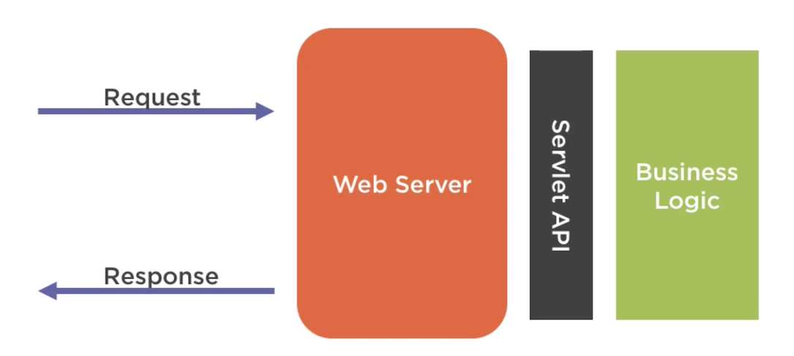
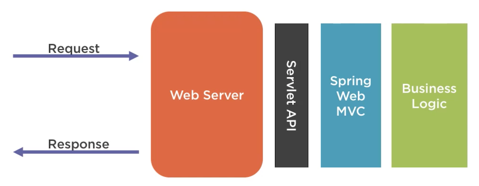

# JavaAppSandBox

Java App SandBox used for playing with java methods

## Identifiers

Allowed : MyClass, MY_CLASS, $MyClass, MyClass_123

## Variables Primitives

- Java Primitives variables types : the most efficient variable to use
- Java stores primitive variables directly in memory
- Non-primitive variables are references to where the value is stored
- Primitives require less memory to store
- Primitives are more efficient to retrieve

|  Primitive |  Description | Default  | Size   |  Range |
|---|---|---|---|---|
|  boolean | True or False  |  | 1  bit | True or False   |
|  byte |  Integer, takes 1 byte of memory | 0  | 8 bits  | -127 to 128  |
|  char |  Unicode character | \u0000  | 16 bits  |  ASCII values 0 to 256 |
|  short |  Integer, takes 2 bytes of memory | 0  | 16 bits  |   |
|  int |  Integer, takes 4 bytes of memory | 0  | 32 bits  |   |
|  long | Integer, takes 8 bytes of memory  | 0  | 64 bits  |   |
|  float |  Floating point number | 0,0  | 32 bits  |   |
|  double | Floating point number  | 0,0  | 64 bits  |   |
    
## Unicode 

- Unicode is a character encoding standard
- Character encoding is a mapping of binary values to human readable values
- Example :

| Human Character | binary representation | unicode code point | java unicode |
|---|---|---|---|
| A | 01000001| U+0041 | \u0041 |
| B | 01000010| U+0042 | \u0042 |
| C | 01000011| U+0043 | \u0043 |


- Unicode is one of MANY character encoding standards
- Reference (https://en.wikibooks.org/wiki/Unicode/Character_reference/0000-0FFF)

## Bits and Bytes

- A bit stores just a 0 or 1
- 16 bits space provides for over 60000 characters
- 8 bits = 1 byte
- One byte can store one character, e.g. 'A'
    - 1 bit - 2 patterns
    - 2 bits - 4 patterns
    - 3 bits - 8 patterns
    - 4 bits - 16 patterns
    - 5 bits - 32 patterns
    - 6 bits - 64 patterns
    - 7 bits - 128 patterns
    - 8 bits - 256 patterns (one byte)
- With 256 different patterns, we can store a number in the range 0..255
    
## BDD

Behavior Driven Development : describes the expected behavior of software, it's expressive. (Given, When, Then)

Spock : BDD Framework

## Testing Components

### Mocks

Fake implementation of a class

### Spy

Like a mock, but real object is used

## Streams

An ordered sequence of data

| Type of streams | Byte streams |  Text streams |
|---|---|---|
| Interacts | with binary data |  as Unicode character |
| ReadFrom |   `InputStream` Class and `read` method | `Reader` Class and `read` method |
| WriteTo |   `OutputStream` Class and `write` method| `Writer` Class and `write` method|


``` 
Reader reader;
try {
    reader = // open reader
    // do something
} catch(IOEXception e) {
    // handle exception
} finally {
    reader.close();
}
```

Try With Resources automatically handles the close()`

## Arrays & Collections

### Arrays

- Array length is immutable
- To "view" values => `Arrays.toString(theArray)`

### Map

| Map Implementation |  Description |
|---|---|
| HashMap | no order guaranteed|
| LinkedHashMap | insertion order is preserved |
| TreeMap | elements are in sorted order by key |


Class that maps keys to values using the Collections Framework :
```
public class HashMap<K,V> extends AbstractMap<K,V> implements Map<K,V>
```

### Set

| Set Implementation |  Description |
|---|---|
| HashSet | no order guaranteed|
| LinkedHashSet | insertion order is preserved |
| TreeSet | elements are in sorted order by key |

## Fundamentals

### POO

Les instances d'une classe sont des objets.

L'instanciation est l'action d'instancier, de créer un objet à partir d'un modèle. Elle est réalisée par la composition de deux opérations : l'allocation et l'initialisation.
- L'**allocation** consiste à réserver un espace mémoire au nouvel objet.
- L'**initialisation** consiste à fixer l'état du nouvel objet


### Polymorphism

Polymorphism allows to use a parent class reference to refer to a child class object. For example:

```
public abstract class Animal{...}
public class Dog extends Animal{...}
Animal animal = new Dog();
```

### Static members

une variable static dans une classe n'est définie qu'une seule fois quel que soit le nombre d'objets instanciés de la classe

```
public class MaClasse() { 
    static int compteur = 0;
}
```

| Static Field |  Static Method |
|---|---|
| a value not associated with a specific instance | action not tied to a specific instance|
| All instances access the same value | can access static field only |

Accessible using the class name

OR 

`static import` provides short hand for accessing static members without using the class name.

In `java.lang.Math` and other `java.lang classes, `static` modifier is generally used on all methods


## Lambdas

- Lambdas improves the usage of an anonymous class.
- Lambdas work with functional interface

### Functional Interfaces

A Functional Interfaces is an interface with a single abstract method and optionally, any number of default and static methods.

Examples : 

| Interface |  Abstract Method |
|---|---|
| java.util Comparator  | compare|
| EventHandler | handle |

### Servlet

A (java) servlet is an object that receives a request and generates a response based on that request. It's a low-level API.



## Spring Boot

### Main features

- Auto-configuration (based on the dependencies added)
- Standalone (springboot embeds a web server within the app )
- Opinionated (choices made for us)

## Spring Framework

### Core

This is the foundation module including internationalization, validation, data binding, type conversion and more.

Dependency Injection : this is about dealing with the way objects fulfill their dependent objects

Spring Core is a dependency injection container


### Web

#### Web MVC

Provides a higher level API that ServletAPI.

Easier to provide proper design (#SeparationOfConcerns #MVC)


#### Web Flux

Handling web request focusing on streams of data and how they changes.
 
\#Reactive Programing : Don't wait for change. React for change.

Web requests :
- are executed asynchronously
- aren't block don't wait (=>better resource utilization))

### AOP

A way of programming that increases organization of code for concerns that span multiple tiers or layers of an application. 

Spring AOP is used to implement features in Spring. It's a valuable tool for developers to handle cross-cutting concerns

Example : `@PreAuthorize`

### Data Access

Example : `@Transactional`

### Integration

Example : `@RestController`


### Testing
