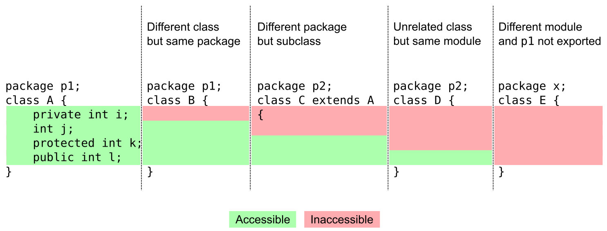

# JavaAppSandBox

Java App SandBox used for playing with java methods

## Identifiers

Allowed : MyClass, MY_CLASS, $MyClass, MyClass_123

## Variables Primitives

- Java Primitives variables types : the most efficient variable to use
- Java stores primitive variables directly in memory
- Non-primitive variables are references to where the value is stored
- Primitives require less memory to store
- Primitives are more efficient to retrieve

|  Primitive |  Description | Default  | Size   |  Range |
|---|---|---|---|---|
|  boolean | True or False  |  | 1  bit | True or False   |
|  byte |  Integer, takes 1 byte of memory | 0  | 8 bits  | -127 to 128  |
|  char |  Unicode character | \u0000  | 16 bits  |  ASCII values 0 to 256 |
|  short |  Integer, takes 2 bytes of memory | 0  | 16 bits  |   |
|  int |  Integer, takes 4 bytes of memory | 0  | 32 bits  |   |
|  long | Integer, takes 8 bytes of memory  | 0  | 64 bits  |   |
|  float |  Floating point number | 0,0  | 32 bits  |  precision of 6 to 7 decimal digits. |
|  double | Floating point number  | 0,0  | 64 bits  | precision of 15 to 16 decimal digits.  |

## Unicode

- Unicode is a character encoding standard
- Character encoding is a mapping of binary values to human readable values
- Example :

| Human Character | binary representation | unicode code point | java unicode |
|---|---|---|---|
| A | 01000001| U+0041 | \u0041 |
| B | 01000010| U+0042 | \u0042 |
| C | 01000011| U+0043 | \u0043 |

- Unicode is one of MANY character encoding standards
- Reference (https://en.wikibooks.org/wiki/Unicode/Character_reference/0000-0FFF)

## Bits and Bytes

- A bit stores just a 0 or 1
- 16 bits space provides for over 60000 characters
- 8 bits = 1 byte
- One byte can store one character, e.g. 'A'
    - 1 bit - 2 patterns
    - 2 bits - 4 patterns
    - 3 bits - 8 patterns
    - 4 bits - 16 patterns
    - 5 bits - 32 patterns
    - 6 bits - 64 patterns
    - 7 bits - 128 patterns
    - 8 bits - 256 patterns (one byte)
- With 256 different patterns, we can store a number in the range 0.255

## Operator precedence

Knowing operator precedence can help you identify which parts of an expression are evaluated first and which parts will follow. Here is an
operator precedence list from highest precedence to lowest precedence:

| Operator | Precedence | Description |
|---|---|---|
| Postfix unary | expr++, expr--| Value change only occurs after overall expression is evaluated | 
| Prefix unary | ++expr, --expr  | - | 
| Other unary | +expr, -expr, !expr  | - | 
| Multiply, Divide, Modulus | * / % | - |
| Add, Subtract | + - | - |
| Relational | < > <= >= instanceof | - |
|  Equality | == != | - |
| Bitwise AND | & | Both sides must be true. Both sides are tested |
| Bitwise exclusive OR | ^ | One side must be false and the other side true |
| Bitwise inclusive OR | &#124; | At least one side must me true. Both sides are tested |
| Logical AND | && | Both sides must be true. IF LEFT side = false THEN false |
| Logical OR | &#124;&#124; | At least one side must be true. IF LEFT is true THEN true |
| Ternary | ? : | - |
| Assignment | = += -= *= /= %= &= ^= &#124;= <<= >>= >>>= | - |

Unary operators (++, --) operate on a variable in the order in which they are placed.

## Inheritence


## Encapsulation

Encapsulation in Java is a mechanism of wrapping the data (variables) and code acting on the data (methods) together as a single unit. In
encapsulation, the variables of a class will be hidden from other classes, and can be accessed only through the methods of their current
class. Therefore, it is also known as data hiding.

To achieve encapsulation in Java −

Declare the variables of a class as private.

Provide public setter and getter methods to modify and view the variables values.

## Serialization

Serialization is the conversion of a Java object into a static stream (sequence) of bytes, which we can then save to a database or transfer
over a network. Use keyword `transient` to ignore class fields during serialization.

Illustration with the `Person` class:

```java
public class Person implements Serializable {

  private static final long serialVersionUID = 1L;
  static String country = "ITALY";
  private int age;
  private String name;
  transient int height;

  // getters and setters
}
```

Example of saving an object of type Person to a local file, and then reading the value back in

```java
@Test
public void whenSerializingAndDeserializing_ThenObjectIsTheSame{
    throws IOException,ClassNotFoundException{
    Person person=new Person();
    person.setAge(20);
    person.setName("Joe");

    FileOutputStream fileOutputStream
    =new FileOutputStream("yourfile.txt");
    ObjectOutputStream objectOutputStream
    =new ObjectOutputStream(fileOutputStream);
    objectOutputStream.writeObject(person);
    objectOutputStream.flush();
    objectOutputStream.close();

    FileInputStream fileInputStream
    =new FileInputStream("yourfile.txt");
    ObjectInputStream objectInputStream
    =new ObjectInputStream(fileInputStream);
    Person p2=(Person)objectInputStream.readObject();
    objectInputStream.close();

    assertTrue(p2.getAge()==person.getAge());
    assertTrue(p2.getName().equals(person.getName()));
    }
```

## Reflexion

## Access Modifiers



### Explanations

- A **private** member (i) is only accessible within the same class as it is declared.
- A member with **no access modifier** (j) is only accessible within classes in the same package.
- A **protected** member (k) is accessible within all classes in the same package and within subclasses in other packages.
- A **public** member (l) is accessible to all classes (unless it resides in a module that does not export the package it is declared in).

#### Which modifier to choose?

Access modifiers is a tool to help you to prevent accidentally breaking encapsulation(*). Ask yourself if you intend the member to be
something that's internal to the class, package, class hierarchy or not internal at all, and choose access level accordingly.

#### Examples:

- A field long internalCounter should probably be private since it's mutable and an implementation detail.
- A class that should only be instantiated in a factory class (in the same package) should have a package restricted constructor, since it
  shouldn't be possible to call it directly from outside the package.
- An internal void beforeRender() method called right before rendering and used as a hook in subclasses should be protected.
- A void saveGame(File dst) method which is called from the GUI code should be public.

## Behavior Driven Development

BDD describes the expected behavior of software, it's expressive. (Given, When, Then)

Spock : BDD Framework

## Testing Components

### Mocks

Fake implementation of a class

### Spy

Like a mock, but real object is used

## Streams

An ordered sequence of data

| Type of streams | Byte streams |  Text streams |
|---|---|---|
| Interacts | with binary data |  as Unicode character |
| ReadFrom |   `InputStream` Class and `read` method | `Reader` Class and `read` method |
| WriteTo |   `OutputStream` Class and `write` method| `Writer` Class and `write` method|

``` 
Reader reader;
try {
    reader = // open reader
    // do something
} catch(IOEXception e) {
    // handle exception
} finally {
    reader.close();
}
```

Try With Resources automatically handles the close()`

## Arrays & Collections

### Arrays

- Array length is immutable
- To "view" values => `Arrays.toString(theArray)`

### Map

| Map Implementation |  Description |
|---|---|
| HashMap | no order guaranteed|
| LinkedHashMap | insertion order is preserved |
| TreeMap | elements are in sorted order by key |

Class that maps keys to values using the Collections Framework :

```
public class HashMap<K,V> extends AbstractMap<K,V> implements Map<K,V>
```

### Set

| Set Implementation |  Description |
|---|---|
| HashSet | no order guaranteed|
| LinkedHashSet | insertion order is preserved |
| TreeSet | elements are in sorted order by key |

## Fundamentals

### POO

Les instances d'une classe sont des objets.

L'instanciation est l'action d'instancier, de créer un objet à partir d'un modèle. Elle est réalisée par la composition de deux opérations :
l'allocation et l'initialisation.

- L'**allocation** consiste à réserver un espace mémoire au nouvel objet.
- L'**initialisation** consiste à fixer l'état du nouvel objet

### Encapsulation

Encapsulation is one of the four fundamental OOP concepts. The other three are inheritance, polymorphism, and abstraction.

Encapsulation in Java is a mechanism of wrapping the data (variables) and code acting on the data (methods) together as a single unit. In
encapsulation, the variables of a class will be hidden from other classes, and can be accessed only through the methods of their current
class. Therefore, it is also known as data hiding.

To achieve encapsulation in Java:

- Declare the variables of a class as private.
- Provide public setter and getter methods to modify and view the variables values.

```java
/* File name : EncapTest.java */
public class EncapTest {

  private String name;
  private String idNum;
  private int age;

  public int getAge() {
    return age;
  }

  public String getName() {
    return name;
  }

  public String getIdNum() {
    return idNum;
  }

  public void setAge(int newAge) {
    age = newAge;
  }

  public void setName(String newName) {
    name = newName;
  }

  public void setIdNum(String newId) {
    idNum = newId;
  }
}
```

The public setXXX() and getXXX() methods are the access points of the instance variables of the EncapTest class. Normally, these methods are
referred as getters and setters. Therefore, any class that wants to access the variables should access them through these getters and
setters.

```java
/* File name : RunEncap.java */
public class RunEncap {

  public static void main(String args[]) {
    EncapTest encap = new EncapTest();
    encap.setName("James");
    encap.setAge(20);
    encap.setIdNum("12343ms");

    System.out.print("Name : " + encap.getName() + " Age : " + encap.getAge());
  }
}
```

Benefits of Encapsulation:

- The fields of a class can be made read-only or write-only.
- A class can have total control over what is stored in its fields.

### Polymorphism

Polymorphism allows to use a parent class reference to refer to a child class object. For example:

```
public abstract class Animal{...}
public class Dog extends Animal{...}
Animal animal = new Dog();
```

### Static members

une variable static dans une classe n'est définie qu'une seule fois quel que soit le nombre d'objets instanciés de la classe

```
public class MaClasse() { 
    static int compteur = 0;
}
```

| Static Field |  Static Method |
|---|---|
| a value not associated with a specific instance | action not tied to a specific instance|
| All instances access the same value | can access static  field only |

Accessible using the class name

OR

`static import` provides short hand for accessing static members without using the class name.

In `java.lang.Math` and other `java.lang classes, `static` modifier is generally used on all methods

## Lambdas

- Lambdas improves the usage of an anonymous class.
- Lambdas work with functional interface

### Functional Interfaces

A Functional Interfaces is an interface with a single abstract method and optionally, any number of default and static methods.

Examples :

| Interface |  Abstract Method |
|---|---|
| java.util Comparator  | compare|
| EventHandler | handle |

### Servlet

A (java) servlet is an object that receives a request and generates a response based on that request. It's a low-level API.


## Spring Boot

### Main features

- Auto-configuration (based on the dependencies added)
- Standalone (springboot embeds a web server within the app )
- Opinionated (choices made for us)

## Spring Framework

### Core

This is the foundation module including internationalization, validation, data binding, type conversion and more.

Dependency Injection : this is about dealing with the way objects fulfill their dependent objects

Spring Core is a dependency injection container

### Web

#### Web MVC

Provides a higher level API that ServletAPI.

Easier to provide proper design (#SeparationOfConcerns #MVC)


#### Web Flux

Handling web request focusing on streams of data and how they changes.

\#Reactive Programing : Don't wait for change. React for change.

Web requests :

- are executed asynchronously
- aren't block don't wait (=>better resource utilization))

### AOP

A way of programming that increases organization of code for concerns that span multiple tiers or layers of an application.

Spring AOP is used to implement features in Spring. It's a valuable tool for developers to handle cross-cutting concerns

Example : `@PreAuthorize`

### Data Access

Example : `@Transactional`

### Integration

Example : `@RestController`

### Testing
